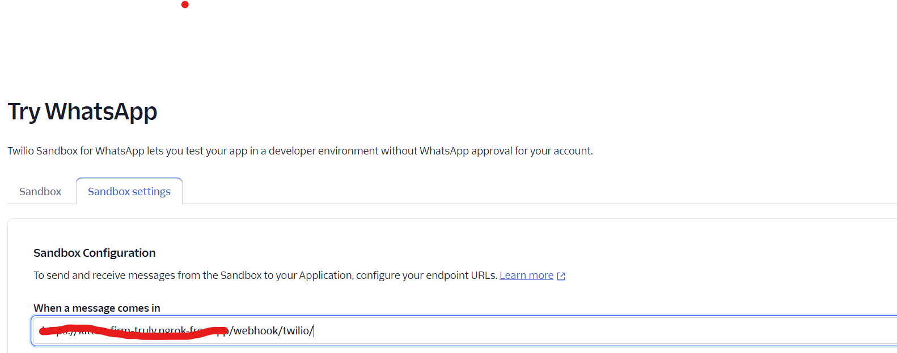
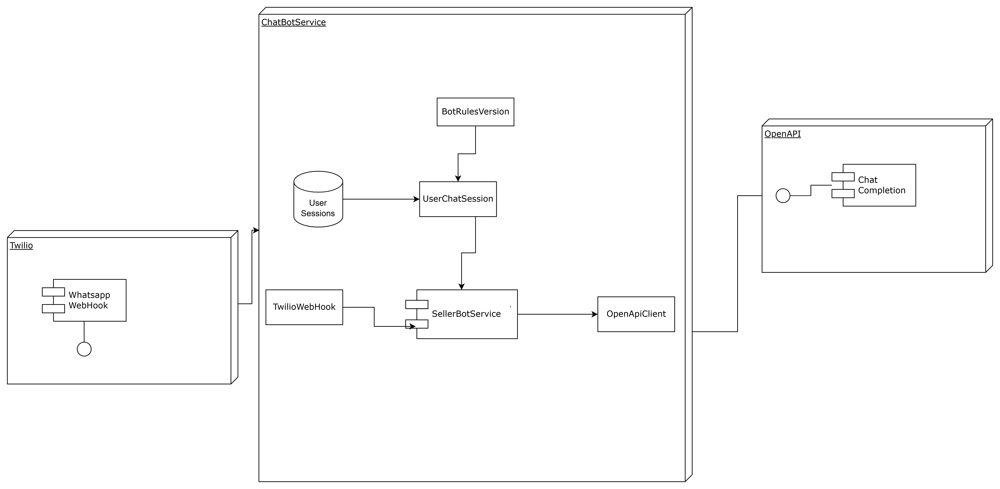

# Simple djangoBot Implementation powered by OpenAI


## Structure

### api
Based on Django-like basic structure
apps/  \
├─ seller/ (django app) \
│  ├─ migrations/ (all database operations for this app)\
│  ├─ __init__.py\
│  ├─ admin.py (admin model declarations)\
│  ├─ apps.py (app django config)\
│  ├─ models.py (models declarations)\
│  ├─ serializers.py (drf serializers for the app)\
│  ├─ test.py\
│  ├─ urls.py (app urls)\
│  ├─ views.py \
├─ templates/ (django templates)\
├─ DjangoBot/\
│  ├─ __init__.py\
│  ├─ asgi.py\
│  ├─ settings.py  (django main config)\
│  ├─ urls.py   (root of urls)\
│  ├─ wsgi.py\
├─ .env\
├─ __init__.py\
├─ Dockerfile\
├─ Docker-compose\
├─ manage.py\
├─ requirements.txt\


## Prerequisites
To setup your local environment, you need install Docker Engine and docker-compose. You can follow the instructions [here](#How-to-install-Docker) to install.

### How to install Docker

Docker Engine is available on a variety of [MacOS](https://docs.docker.com/docker-for-mac/install/)

### How to install docker-compose

Docker compose is available on [MacOs](https://docs.docker.com/compose/install/)


### Running services

If you have already set up your local environment and have a **.env** file with the development variables set, this command builds the image  services:

```shell
$ docker-compose up -d
```
  - [http://127.0.0.1:8000](http://127.0.0.1:5000) is the Django app


## How to rebuild the docker image

In case you want the changes you have been testing to remain permanently in a new docker image you can rebuild the image, run this command:

```shell
$ docker-compose build
$ docker-compose up -d
```

After the build, you can remove the previous image with:

```shell
$ docker image prune -f
```

## Container shell access 

The docker exec command allows you to run commands inside a Docker container. The following command line will give you a bash shell inside your containers: `docker exec -it <container_name> <command>`


## Services

### Easy bot test
Allows test the 

```http
POST /seller/bot/
{
    "msg": "",
    "user_id": ""
}
```


### TwilioWebhook
Allows test the bot via Whatsapp using twilio 

```http
POST webhook/twilio/
{
    "MessageSid": "",
    "SmsSid": "",
    "AccountSid": "",
    "From": "",
    "To": "",
    "Body": ""
}
```
In order to be used is needed to configure the sandbox from twilio

Also is important to be accessible via internet, this could be done using [ngrok](https://ngrok.com/use-cases/webhook-testing)


## Arquitectura del Bot 


## Backlog 

Para llevar a producción (Usando AWS)
Dockerizar Servicio
Generar Cluster ECS
Seleccionar 
Generar CI/CD script (Git hub actions)


- Generar pruebas unitarias de los componentes
- Generar Logs de latencia de respuesta del agente para medir el performance general 
- Añadir encuesta de NPS a la interacción del bot 
- Generar Plan de regresión para testear el bot
	- Casos de uso standard
	- Reacción del bot a peticiones fuera de su objetivo 
	- 
- Modificar el proceso de ingesta de datos de autos con las siguientes características
	- El Catalogo de marcas debe ser siempre accesible por el bot
	- Los modelos disponibles deben provenir de una tabla en base de datos, el bot se encargara de generar los filtros y el servicio de generar un listado acorde, adicionalmente se debe informar al agente la lista retornada, numero de paginas extra y la actual
	- La ventana de contexto debe ser limpiada una vez llegado al limite de tokens manteniendo siempre las reglas
- Generar mecanismos de limpieza de contexto para que el usuario pueda limpiar manualmente la session
- Establecer tiempo de vida de session (días, semanas, etc)
